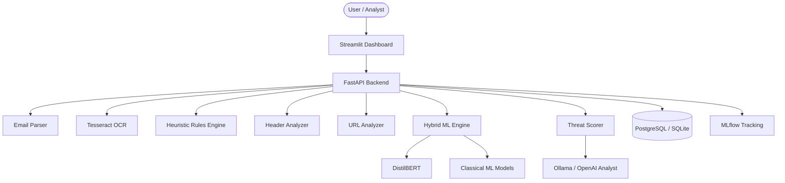

# PhishIntel AI

### Explainable Multimodal Phishing Intelligence and Threat Auditing System using DistilBERT

PhishIntel is an AI-powered phishing analysis platform that combines classical machine learning, transformer-based NLP, rule-based threat detection, and LLM reasoning to generate explainable phishing intelligence reports.

The project is designed as an end-to-end prototype for detecting suspicious emails, pasted messages, uploaded `.eml` files, and screenshots of suspicious content.

## Features

- FastAPI backend for phishing analysis APIs
- Streamlit dashboard for scanning, analytics, and historical audit review
- Hybrid detection using DistilBERT, classical ML, and rule-based scoring
- Explainable indicators for suspicious words, rules, URLs, and headers
- URL typosquatting and suspicious-domain checks
- SPF, DKIM, DMARC, sender, and reply-to header analysis
- Screenshot OCR support with Tesseract
- Optional GenAI analyst summaries using Ollama or OpenAI
- PostgreSQL support with Docker Compose and SQLite fallback for local runs
- MLflow service for experiment tracking in Docker mode

## Architecture



## Tech Stack

- **Backend:** FastAPI, SQLAlchemy, Pydantic
- **Frontend:** Streamlit
- **ML/NLP:** PyTorch, Transformers, scikit-learn, XGBoost
- **Explainability:** Token attribution and rule-level explanations
- **Database:** PostgreSQL in Docker, SQLite fallback locally
- **OCR:** Tesseract via `pytesseract`
- **Experiment Tracking:** MLflow
- **Containerization:** Docker Compose

## Threat Classification Output

The system reports phishing results at three levels:

1. **Final risk verdict** from the composite threat scorer:
   - `Safe`
   - `Suspicious`
   - `High Phishing Risk`

2. **GenAI analyst threat type** from Ollama/OpenAI or the deterministic fallback:
   - `Safe Email`
   - `Suspicious Message`
   - `Potential Phishing Scam`
   - `Credential Harvesting`
   - `Brand Impersonation`
   - `Financial Wire Fraud`
   - Other closely related threat labels generated by the configured LLM

3. **Rule-based technique indicators** from the heuristic engine, such as:
   - Credential harvesting lures
   - Urgency or pressure tactics
   - Impersonation patterns
   - Financial request bait
   - Prize or reward bait
   - Password reset bait
   - Account suspension threats
   - Invoice or false billing scams
   - Gift card solicitation
   - QR-code phishing
   - Dangerous attachment risk

For benign text with no suspicious rules, URLs, or header anomalies, the fallback report classifies the message as `Safe Email` with `Low` severity.

## Repository Structure

```text
.
|-- backend/
|   |-- app/
|   |   |-- api/endpoints/       # Analysis, history, dashboard, health APIs
|   |   |-- core/                # App settings and lazy-loaded dependencies
|   |   |-- database/            # SQLAlchemy models and sessions
|   |   |-- llm/                 # GenAI report generation
|   |   |-- ml/                  # Datasets, training, inference, benchmarks
|   |   |-- rules/               # Heuristic phishing rules
|   |   |-- schemas/             # Pydantic request/response models
|   |   |-- services/            # Parser, OCR, URL, header, and scoring services
|   |   `-- main.py              # FastAPI application entry point
|-- frontend/
|   `-- streamlit_app.py         # Streamlit user interface
|-- docker/
|   `-- backend.Dockerfile       # Backend image definition
|-- datasets/                    # Train, validation, and test datasets
|-- experiments/                 # Benchmark outputs
|-- docker-compose.yml           # Local container orchestration
|-- requirements.txt             # Root requirements redirect
|-- spam.csv                     # Base dataset
`-- README.md
```

## Getting Started

### Prerequisites

- Python 3.10 or later
- Docker Desktop, if running with Docker
- Tesseract OCR, if running OCR locally outside Docker
- Optional: Ollama running locally for local LLM summaries
- Optional: OpenAI API key for OpenAI-backed summaries

## Run With Docker Compose

Docker Compose starts PostgreSQL, MLflow, FastAPI, and Streamlit.

```bash
docker compose up --build
```

Open the Streamlit app:

```text
http://localhost:8501
```

Other services:

- FastAPI docs: `http://localhost:8000/docs`
- MLflow UI: `http://localhost:5000`
- Backend health: `http://localhost:8000/api/v1/health`

To stop containers while keeping scan history:

```bash
docker compose down
```

To reset Docker scan history, delete the PostgreSQL volume:

```bash
docker compose down -v
```

## Run Locally Without Docker

Create and activate a virtual environment:

```bash
python -m venv venv
```

Windows PowerShell:

```powershell
.\venv\Scripts\Activate.ps1
```

macOS/Linux:

```bash
source venv/bin/activate
```

Install dependencies:

```bash
pip install -r backend/requirements.txt
```

Start the FastAPI backend:

```bash
uvicorn backend.app.main:app --reload
```

Start the Streamlit frontend in a second terminal:

```bash
streamlit run frontend/streamlit_app.py
```

Local app URLs:

- Streamlit UI: `http://localhost:8501`
- FastAPI docs: `http://localhost:8000/docs`

When `DATABASE_URL` is not set, the backend falls back to `phishing_db.sqlite` in the project root.

To reset local scan history:

```powershell
Remove-Item .\phishing_db.sqlite
```

## Configuration

Configuration is read from environment variables or an optional `.env` file.

```env
DATABASE_URL=sqlite+aiosqlite:///./phishing_db.sqlite
OLLAMA_HOST=http://localhost:11434
OLLAMA_MODEL=llama3
OPENAI_API_KEY=
OPENAI_MODEL=gpt-4o-mini
MLFLOW_TRACKING_URI=sqlite:///mlflow.db
TESSERACT_CMD=
```

In Docker mode, `DATABASE_URL`, `OLLAMA_HOST`, and `MLFLOW_TRACKING_URI` are supplied by `docker-compose.yml`.

## API Overview

Main endpoints are available under `/api/v1`.

| Method | Endpoint | Description |
| --- | --- | --- |
| `GET` | `/api/v1/health` | Backend health check |
| `POST` | `/api/v1/analyze/email` | Analyze pasted email or message text |
| `POST` | `/api/v1/analyze/email/upload` | Analyze uploaded `.eml` file |
| `POST` | `/api/v1/analyze/screenshot` | Extract screenshot text with OCR and analyze it |
| `GET` | `/api/v1/analyze/{analysis_id}` | Retrieve one saved analysis |
| `GET` | `/api/v1/history` | List saved analyses |
| `GET` | `/api/v1/dashboard` | Aggregate dashboard metrics |
| `GET` | `/api/v1/metrics` | Basic backend metrics |

## Model Training and Benchmarking

Run the benchmark module to train/evaluate available models and generate reports:

```bash
python -m backend.app.ml.benchmark
```

Outputs are written to the `experiments/` directory. Trained artifacts such as `best_model.pkl` and `bert_model/` are ignored by Git because they can be large and environment-specific.

## History and Data Privacy

This prototype does not include authentication or per-user accounts. Scan history is shared by everyone connected to the same backend database.

- Docker history is stored in the PostgreSQL `pgdata` volume.
- Local history is stored in `phishing_db.sqlite`.
- Use `docker compose down -v` or delete `phishing_db.sqlite` to reset history.

Authentication, per-user history isolation, role-based access, and a UI clear-history control are planned future enhancements.

## Current Limitations

- No login system or per-user history separation
- OCR quality depends on the local or container Tesseract setup
- LLM reports require either Ollama/OpenAI connectivity or fallback to deterministic summaries
- Large model files are not intended to be committed to Git
- This is a research/prototype system and should not be used as a sole production security control

## Future Improvements

- User authentication and per-user audit history
- Clear-history option in the Streamlit UI
- CI/CD pipeline for automated tests and container builds
- Expanded test suite for API endpoints and scoring logic
- Better model artifact management
- Additional phishing datasets and evaluation reports

## Disclaimer

This project is for educational and research purposes. It can assist analysts by highlighting suspicious signals, but final security decisions should be validated with trusted security tools and human review.
