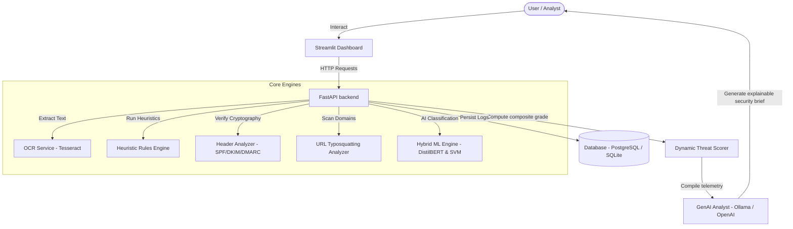

# Enterprise GenAI Phishing Intelligence Platform

AI-powered phishing analysis platform that combines classical machine learning, transformer-based NLP, rule-based threat detection, and LLM reasoning to generate explainable phishing intelligence reports.

---

## 🏗️ System Architecture



---

## 📁 Repository Structure

```text
enterprise-genai-phishing-platform/
├── backend/
│   ├── app/
│   │   ├── api/
│   │   │   └── endpoints/
│   │   │       ├── analysis.py       # Scans (JSON, EML upload, screenshot OCR)
│   │   │       └── history.py        # Pagination, dashboard aggregation
│   │   ├── core/
│   │   │   ├── config.py             # Settings using Pydantic Settings
│   │   │   └── dependencies.py       # Singletons (Predictor, LLMAnalyst)
│   │   ├── database/
│   │   │   ├── models.py             # Declarative SQLAlchemy Database Schemas
│   │   │   └── session.py            # DB Sessions (PostgreSQL / SQLite fallback)
│   │   ├── llm/
│   │   │   └── client.py             # GenAI report builder (Ollama / OpenAI)
│   │   ├── ml/
│   │   │   ├── classical/
│   │   │   │   └── pipeline.py       # TF-IDF + Classical wrappers (XGB, RF, SVM)
│   │   │   ├── distilbert/
│   │   │   │   └── pipeline.py       # PyTorch sequence classification training
│   │   │   ├── inference/
│   │   │   │   └── predictor.py      # Attribution and evaluation logic
│   │   │   ├── benchmark.py          # Baseline comparisons and chart exports
│   │   │   └── dataset.py            # Clean, stratified train/val/test splits
│   │   ├── rules/
│   │   │   └── engine.py             # Heuristics threat checks (12 security rules)
│   │   ├── schemas/
│   │   │   └── analysis.py           # Standardized Pydantic DTO validation
│   │   ├── services/
│   │   │   ├── email_parser.py       # Plain text / EML structure parsing
│   │   │   ├── header_analyzer.py    # SPF/DKIM/DMARC metadata checks
│   │   │   ├── ocr_service.py        # Tesseract screenshot text extraction
│   │   │   └── threat_scorer.py      # Multimodal aggregate risk indexer
│   │   └── main.py                   # FastAPI initialization
│   └── tests/                        # 11 unit & integration tests
│
├── frontend/
│   └── streamlit_app.py              # Dashboard visual interface
│
├── docker/
│   └── backend.Dockerfile            # Multi-stage image build setup
│
├── .github/
│   └── workflows/
│       └── ci.yml                    # Automated tests execution
│
├── docker-compose.yml                # Orchestrates DB, MLflow, and services
└── spam.csv                          # Base training dataset
```

---

## 🚀 Key Modules Built

### 1. Hybrid Machine Learning & AI
* **DistilBERT (Transformers)**: Fine-tuned deep learning sequence classification (achieving **99.28% accuracy / 97.26% F1 score** on CPU).
* **Explainable AI (XAI)**: Integrated Gradients calculation highlighting which specific words influenced the transformer model's prediction.
* **Classical ML Ensembles**: Logistic Regression, SVM, Random Forest, and XGBoost wrappers for statistical keyword matching.

### 2. Heuristics & Scoring Engine
* **12 Core Rules**: Analyzes urgencies, credential harvesting cues, prize lures, false invoices, quishing (QR codes), call-to-action prompts, and suspicious attachments.
* **Dynamic Scorer**: Re-allocates weights dynamically when specific features (like URLs or headers) are not applicable (e.g. plain text scans), preventing under-scoring.
* **AI-Confidence Floor**: Ensures highly confident transformer classifications (>=85%) are prioritized as High Phishing Risk even if rules aren't triggered.

### 3. URL & Header Scanning
* **Domain Checkers**: Typosquatting detection using Levenshtein distance matching against popular brand domains.
* **Authentication Audits**: Extracts and validates SPF, DKIM, and DMARC headers.
* **Trusted Sender Discount**: Automatically discounts risk rating for cryptographically authenticated, official brand senders (e.g. `@microsoft.com`).

### 4. Generative AI Security Analyst
* Generates security summaries, indicator mappings, and playbooks via local **Ollama** or **OpenAI**. 
* Includes a built-in deterministic fallback generator in case connections time out.

---

## 🔬 Testing & Verification

We wrote 11 unit and integration tests covering the rules engine, URL analyzer, email parser, and API routers.

Run the test suite locally:
```bash
python -m pytest backend/tests
```

All **11/11 tests pass successfully**, verifying that the database engine, endpoints, and threat scorers run correctly.

---

## 🛠 Running the Platform

### Option A: Run via Docker Compose (Recommended)
This starts all components (PostgreSQL, MLflow metrics tracker, FastAPI, and Streamlit) with Tesseract OCR pre-installed:
```bash
docker compose up --build
```
Open **`http://localhost:8501`** in your browser.

---

### Option B: Run Locally (Without Docker)

#### 1. Setup Virtual Environment & Dependencies
```bash
python -m venv venv
# On Windows:
.\venv\Scripts\Activate.ps1
# On Mac/Linux:
source venv/bin/activate

pip install -r backend/requirements.txt
```

#### 2. Run Training Benchmarks (Optional)
This trains your models on the base dataset, saves the checkpoints (`best_model.pkl` and `./bert_model`), and exports comparison charts to the `experiments/` directory:
```bash
python -m backend.app.ml.benchmark
```

#### 3. Start FastAPI Backend Server
```bash
uvicorn backend.app.main:app --reload
```
*Runs at `http://127.0.0.1:8000`.*

#### 4. Start Streamlit Frontend
In a new terminal window:
```bash
streamlit run frontend/streamlit_app.py
```
*Runs at `http://localhost:8501`.*